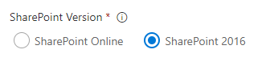
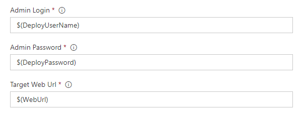
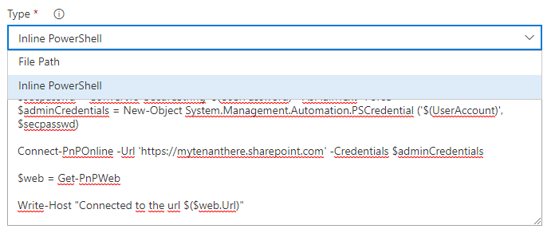

# SharePoint Build and Release Tasks

|||
|-|-|
|Build|[](https://tulevaag-public.visualstudio.com/vsts-sp-tasks/vsts-sp-tasks%20Team/_build/index?context=allDefinitions&path=%5CVSTS-Extensions&definitionId=1&_a=completed)|
|Internal release| [](https://tulevaag-public.visualstudio.com/vsts-sp-tasks/vsts-sp-tasks%20Team/_releases2?definitionId=2&view=mine&_a=releases)|
|Public npm release|[](https://tulevaag-public.visualstudio.com/vsts-sp-tasks/vsts-sp-tasks%20Team/_releases2?definitionId=2&view=mine&_a=releases)|


This extension includes a group of tasks that leverages SharePoint and O365 functionalities for build and release.

## Content:

#### [Task: Deploy SharePoint Artifacts](#Task-Deploy-SharePoint-Artifacts)
#### [Task: PnP PowerShell](#Task-PnP-PowerShell)
#### [Change Logs](#Change-Log)

## <a id="Task-Deploy-SharePoint-Artifacts"> </a> Task Deploy SharePoint Artifacts

Deploys SharePoint artifacts (e.g. lists, fields, content type...) with the publish PnP PowerShell, which uses the PnP Provisioning Engine.
This task works mainly in the same way as described in the documentation of the [PnP PowerShell cmdlet Apply-PnPProvisioningTemplate](https://docs.microsoft.com/en-us/powershell/module/sharepoint-pnp/apply-pnpprovisioningtemplate?view=sharepoint-ps).
This PowerShell task allows you to use [PnP PowerShell](https://docs.microsoft.com/en-us/powershell/module/sharepoint-pnp), which will be loaded prior executing any script. The newest releast modules are downloaded from the official PSGallery feed, if not present on the agent.

### Mandatory Fields

First the SharePoint version has to be choosen.



Then you need to fill the web URL to deploy the artifacts to the chosen web and the credentials which have the permissions to do the changes.



Next, you choose if you want to use a file from your build or if you want to use inline xml. A [specific xml schema is expected](https://github.com/SharePoint/PnP-Provisioning-Schema/blob/master/ProvisioningSchema-2016-05.md) which is parsed by the PnP provisioning engine.


You can include the following XML, which changes the title of the connected web

```xml
<?xml version="1.0"?>
<pnp:Provisioning xmlns:pnp="http://schemas.dev.office.com/PnP/2017/05/ProvisioningSchema">
  <pnp:Preferences Generator="OfficeDevPnP.Core, Version=2.18.1709.0, Culture=neutral, PublicKeyToken=3751622786b357c2" />
  <pnp:Templates ID="CONTAINER-TEMPLATE-CE97DA40966E445087F3E67032B06CC6">
    <pnp:ProvisioningTemplate ID="TEMPLATE-CE97DA40966E445087F3E67032B06CC6" Version="1" BaseSiteTemplate="STS#0" Scope="Web">
      <pnp:WebSettings NoCrawl="false" Title="My Web Title" WelcomePage="" AlternateCSS="" MasterPageUrl="{masterpagecatalog}/seattle.master" CustomMasterPageUrl="{masterpagecatalog}/seattle.master" />
    </pnp:ProvisioningTemplate>
  </pnp:Templates>
</pnp:Provisioning>
```

### Optional Fields

#### Handler To Be Used

Then you can optionally give a comma separated list of Handlers (e.g. Lists,Fields). Leave empty if all Handlers should be used. This Allows you to only process a specific part of the template. Notice that this might fail, as some of the handlers require other artifacts in place if they are not part of what your applying. Check for [available Handlers.](https://msdn.microsoft.com/en-us/pnp_sites_core/officedevpnp.core.framework.provisioning.model.handlers)

#### Parameters To Be Added

The field "Parameters To Be Added" allows you to specify parameters that can be referred to in the template by means of the {parameter:} token. use only one parameter-value pair per line.

Example:

```
ListTitle=Projects 
parameter2=a second value
```


See examples on [how it works internally](https://github.com/SharePoint/PnP-PowerShell/blob/master/Documentation/ApplyPnPProvisioningTemplate.md#example-3).

### Advanced Parameters

#### ClearNavigation
Override the RemoveExistingNodes attribute in the Navigation elements of the template. If you specify this value the navigation nodes will always be removed before adding the nodes in the template.

#### Ignore Duplicate Data Row Errors
Ignore duplicate data row errors when the data row in the template already exists.

#### Overwrite System Property Bag Values
Specify this parameter if you want to overwrite and/or create properties that are known to be system entries (starting with vti_, dlc_, etc.)

#### Provision Content Types To Sub Webs
If set content types will be provisioned if the target web is a subweb.

## <a id="Task-PnP-PowerShell"> </a> Task PnP PowerShell


This task is inspired by the official PowerShell task for VSTS. The source code is [located in GitHub](https://github.com/Microsoft/vsts-tasks). 
This PowerShell task allows you to use [PnP PowerShell](https://docs.microsoft.com/en-us/powershell/module/sharepoint-pnp), which will be loaded prior executing any script. The newest releast modules are downloaded from the official PSGallery feed, if not present on the agent.

### Mandatory Fields

First the SharePoint version has to be choosen.


Next, you choose if you want to use a file from your build or if you want to use inline PowerShell.
The correct PnP PowerShell library is downloaded and imported automatically.



When the type is choosen, the file or inline PowerShell must be a valid PowerShell.
An Example is provided in the following code, where $(UserPassword) and $(UserAccount) must be [previously created variables](https://docs.microsoft.com/en-us/vsts/build-release/concepts/definitions/release/variables).

```powershell
$secpasswd = ConvertTo-SecureString '$(UserPassword)' -AsPlainText -Force
$adminCredentials = New-Object System.Management.Automation.PSCredential ('$(UserAccount)', $secpasswd)

Connect-PnPOnline -Url 'http://mytenanthere.sharepoint.com' -Credentials $adminCredentials

$web = Get-PnPWeb

Write-Host "Connected to the url $($web.Url)"
```

### Optional Fields

#### ErrorActionPreference

Prepends the line $ErrorActionPreference='VALUE' at the top of your script. Possible values are 'STOP', 'CONTINUE' or 'SILENTLYCONTINUE'.

### Advanced Parameters

#### Fail on Standard Error

If this is true, this task will fail if any errors are written to the error pipeline, or if any data is written to the Standard Error stream. Otherwise the task will rely on the exit code to determine failure.

#### Working Directory

Working directory where the script is run.

---
