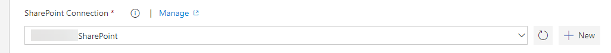

# SharePoint Build and Release Tasks

## Deploy SharePoint Artifacts
 
### Mandatory Fields
Deploys SharePoint artifacts (e.g. lists, fields, content type...) with the publish PnP PowerShell, which uses the PnP Provisioning Engine.

This task work mainly in the same way as described in the documentation of the [PnP PowerShell cmdlet Apply-PnPProvisioningTemplate](https://github.com/SharePoint/PnP-PowerShell/blob/master/Documentation/ApplyPnPProvisioningTemplate.md).

To get it working you need to choose, if you use SharePoint Online or SharePoint 2016.

Then you need to fill the web URL to deploy the artifacts to the chosen web and the credentials which have the permissions to do the changes.

The next you choose if you want to use a file from your build or if you want to use inline xml. A [specific xml schema is expected](https://github.com/SharePoint/PnP-Provisioning-Schema/blob/master/ProvisioningSchema-2016-05.md).

### Optional Fields

#### Handler To Be Used

Then you can optionally give a comma separated list of Handlers (e.g. Lists,Fields). Leave empty if all Handlers should be used. This Allows you to only process a specific part of the template. Notice that this might fail, as some of the handlers require other artifacts in place if they are not part of what your applying. Check for [available Handlers.](https://msdn.microsoft.com/en-us/pnp_sites_core/officedevpnp.core.framework.provisioning.model.handlers)

#### Parameters To Be Added

The field "Parameters To Be Added" allows you to specify parameters that can be referred to in the template by means of the {parameter:} token. use only one parameter-value pair per line.

Example:

ListTitle=Projects
parameter2=a second value 

See examples on [how it works internally](https://github.com/SharePoint/PnP-PowerShell/blob/master/Documentation/ApplyPnPProvisioningTemplate.md#example-3).

#### Advanced Parameters

_ClearNavigation:_ Override the RemoveExistingNodes attribute in the Navigation elements of the template. If you specify this value the navigation nodes will always be removed before adding the nodes in the template.

_Ignore Duplicate Data Row Errors:_ Ignore duplicate data row errors when the data row in the template already exists.

_Overwrite System Property Bag Values:_ Specify this parameter if you want to overwrite and/or create properties that are known to be system entries (starting with vti_, dlc_, etc.)

_Provision Content Types To Sub Webs:_ If set content types will be provisioned if the target web is a subweb.

